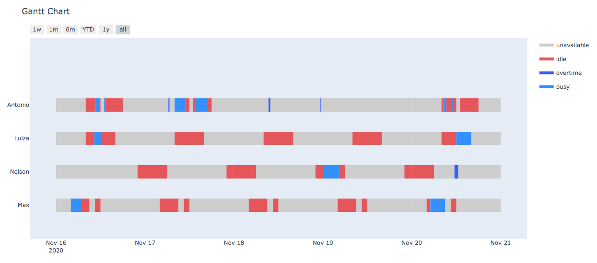

# Maintenance schedule

Planning maintenance tasks, also known as service orders, are often a hard challenge to the Planning and Control Maintenance area (PCM), due to the complex combination of resources available and constraints, resulting in more or less costs. This project is designed to receive a list of tasks allocated for some employees and distribute them in a range, considering their workshift and also the equipments agenda, aiming to minimize costs (reducing overtime and the equipment stops), through Genetic Algorithm.

## Getting Started

These instructions will get you a copy of the project up and running on your local machine for development and testing purposes. See deployment for notes on how to deploy the project on a live system.

### Prerequisites

Some python libraries need to be imported to run the project:

- json
- matplotlib
- pandas
- plotly

### Initial configuration

* **config.py**: define parameters for the genetic algorithm like population size or mutation rate, also define some internal methods that can be used;

* **entry.json**: used to the define employees and their hourly wage, the period available for task allocation and the tasks (service orders) and their characteristics;

* **entry-work-shift.json**: used to define the works shift of each employee;

* **entry-gantt.json**: used only to test the gantt chart.


## Running

After setting up the configurations and entry files with tasks and workshifts, just run:

```
python3 main.py
```

## Results



## Authors

* **Felipe N. Welter** - *Initial work* - [github](https://github.com/felipenwelter)

## License

This project is licensed under the MIT License - see the [LICENSE.md](LICENSE.md) file for details

## Acknowledgments

* The project was first developed for the discpline of Natural Computing (UDESC).

## Future improvements

- Algorithm could also define the employee for each task, beyond only day and time;
- Tasks must respect tollerance interval, not to be allocated far from expected maintenance date;
- Auto adjustment of parameters, like population size and number of generations;
- Consider employee specialties to auto allocate tasks;
- Multiobjective, adding employee ociosity;
- Tasks dependency, reducing makespan.

